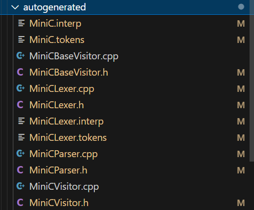
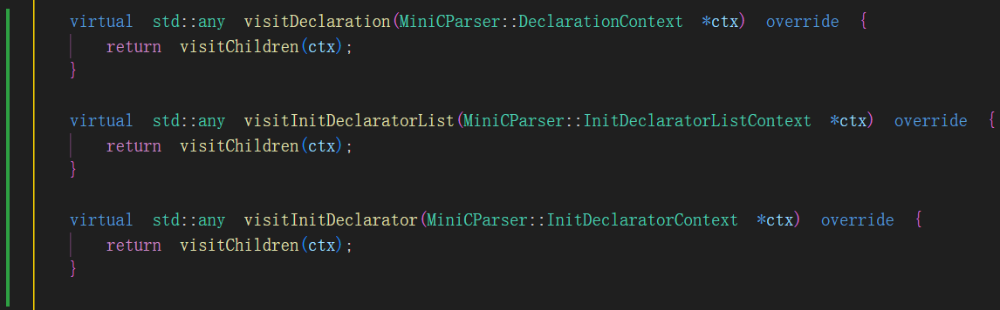
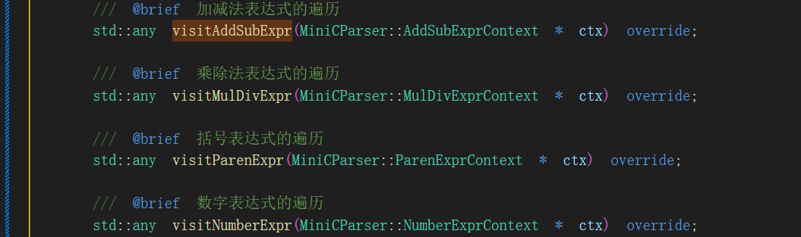
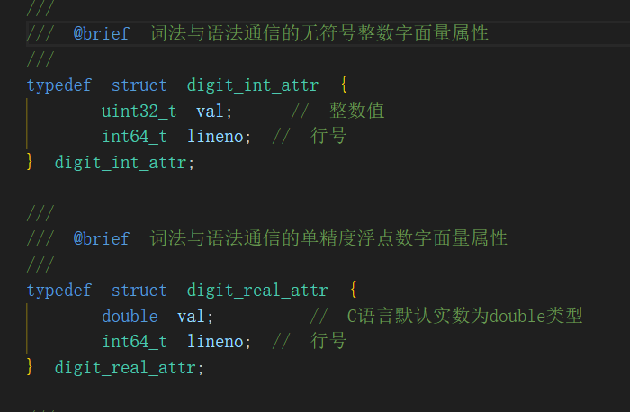
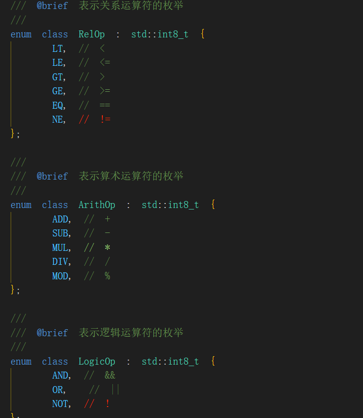
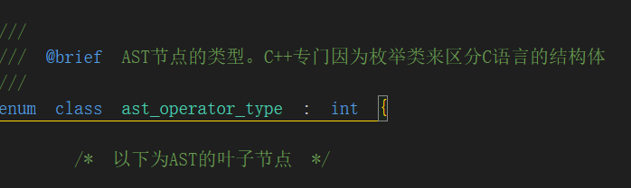
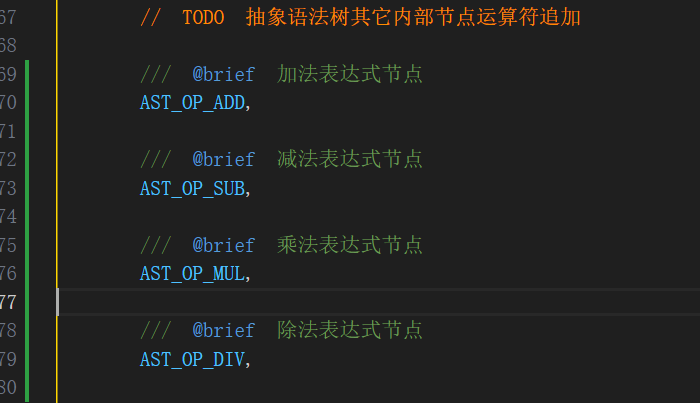
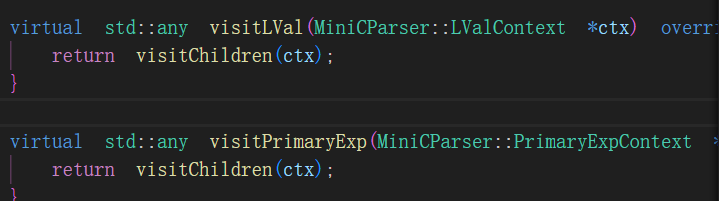
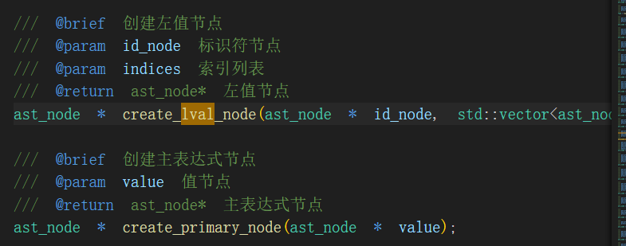

# MiniC开发文档

## 前端部分

### 1.环境配置

-    打开.zshrc

     ```shell
     nano ~/.zshrc
     ```

-    在文件末尾添加三行语句

     ```shell
     export CLASSPATH=".:$HOME/.antlr4/antlr-4.13.1-complete.jar:$CLASSPATH"
     alias antlr4='java -jar $HOME/.antlr4/antlr-4.13.1-complete.jar'
     alias grun='java org.antlr.v4.gui.TestRig'
     ```

-    sourse一下

     ```shell
     source ~/.zshrc
     ```

-    测试一下，输入antlr4

     ```shell
     antlr4
     ```

### 2.开发实践

为了扩充编译器的功能，我们首先修改编译器的前端部分的词法分析和语法分析

==注意：如果点击Debug minic Antlr4 Grammar的Debug按钮没有反应，那请你把G4文件打开，再Debug==

#### 2.1 G4文件的修改

这就是典型的语法产生式的撰写：==**非终结符+产生式**==

```antlr4
//添加对多个函数的支持
compileUnit: (funcDef)+;

//添加对声明变量的支持
blockItem: declaration | statement;

// 声明规则
declaration: T_INT initDeclaratorList T_SEMICOLON;

// 一个声明可以有多个变量：int a, b = 5;
initDeclaratorList: initDeclarator (',' initDeclarator)*;

// initDeclarator: 变量名 或 变量名 = 表达式
initDeclarator: T_ID ('=' expr)?;

statement:
	T_RETURN expr T_SEMICOLON	# returnStatement
	| T_ID '=' expr T_SEMICOLON	# assignStatement;

//新增表达式规则
expr
	: expr op = ('*' | '/') expr		# mulDivExpr
	| expr op = ('+' | '-') expr	# addSubExpr
	| '(' expr ')'					# parenExpr
	| T_ID							# idExpr
	| T_DIGIT						# numberExpr;
```

修改完成后，还要重新生成antlr4相关文件，采用命令如下：

```shell
     antlr4 -Dlanguage=Cpp -visitor -no-listener /home/rui/exp03-minic-basic/frontend/antlr4/MiniC.g4
```

参数说明：

-    -Dlanguage=Cpp 表示生成的语言为C++
-    -visitor 表示生成visitor模式的C++文件
-    -no-listener 表示不生成listener模式的文件
-    /home/rui/exp03-minic-basic/frontend/antlr4/MiniC.g4 这是g4文件的路径

会自动生成文件：



#### 2.1.1 查看MiniCBaseVisitor.h文件

其中，最为重要的就是==MiniCBaseVisitor.h==文件，他包含了所有的类似于**# numberExpr**（#后面跟着的是名字，一个名字应该对应一个函数，例如，这里会在MiniCBaseVisitor.h文件中生成一个VisitnumberExpr虚函数，这个函数是一定需要被重写的）



#### 2.1.2 在Antlr4CSTVisitor.h中查看并添加函数

我们在==Antlr4CSTVisitor.h==函数里面定义2.1.1步骤中所得到的新增函数



#### 2.1.3 修改AttrType.h文件

我们需要在这里添加文法符号的属性类型支持

这里主要就是添加整数、浮点数字面量属性、运算符定义：





#### 2.1.3 修改AST.h文件

##### 2.1.3.1修改这个枚举类型



这个枚举类型都是AST节点的节点类型，如果有新增的运算符，需要追加在这里面

比如我追加了+ - * /这四个运算符，那就要增加到这里,比如：



对于具体添加什么节点，我们在AST.cpp文件中具体实现

##### 2.1.3.2 添加工厂函数

添加的工厂函数主要是实现AST节点的创建的

工厂函数依据MiniCBaseVisitor.h创建，举个例子：

有下面的虚函数：



那么在我的AST.h中就要有以下工厂函数：



##### 2.1.4 修改AST.cpp

在这里，我们实现具体的工厂函数

-    常用的工具函数

     -    新建一个节点

          ```c++
          ast_node * node = new ast_node(ast_operator_type::AST_OP_FUNC_CALL);
          ```

          使用New方法，传入在AST.h中定义的节点类型

     -    插入一个节点

          ```c++
          ast_node * ast_node::insert_son_node(ast_node * node)
          ```

-    

#### 2.2 修改Antlr4Executor.cpp

在这里我们实现Visit函数（节点的遍历创建）

有了上面的工厂函数，我们就可以在每一个Visit中写代码准备好参数，最后return一个工厂函数即可完成对于节点的创建

这里实现起来其实比较复杂，要根据自动生成的MiniCParser.h来实现，因为这些自动生成的类包含着一些根据你的语法产生式生成的独特的属性

-    常用函数

     -    `ctx->XXX()`
           获取当前语法节点的子节点（如表达式、语句、标识符等）。
           示例：`ctx->expr()` 用于获取表达式子节点。

     -    `ctx->XXX(i)`
           当某类子节点存在多个时，按索引访问第 `i` 个子节点。
           示例：`ctx->stmt(i)` 可获取第 `i` 条语句。

     -    `ctx->children`
           获取当前节点的所有子节点，一般用于遍历分析未知或通用结构。
           示例：`for (auto child : ctx->children)` 可遍历所有子节点。

     -    `visit(ctx->XXX())`
           递归访问子节点，通常用于构建 AST 时依次访问各组成部分。
           示例：`visit(ctx->expr())` 会调用相应的 `visitExpr` 方法。
     -    `std::vector<std::unique_ptr<XXXAST>>`
           构造 AST 子节点列表，常用于函数参数、语句块等。
           示例：用于构建 `BlockAST` 的多个语句。
     -    `ctx->getStart()->getLine()`
           获取当前语法节点的起始行号，常用于错误提示或调试信息。
           示例：`int line = ctx->getStart()->getLine();`
     -    `ctx->Ident()->getText()`
           获取当前语法节点的完整文本表示，适用于标识符或原始值提取。
           示例：`std::string varName = ctx->Ident()->getText();`

     
