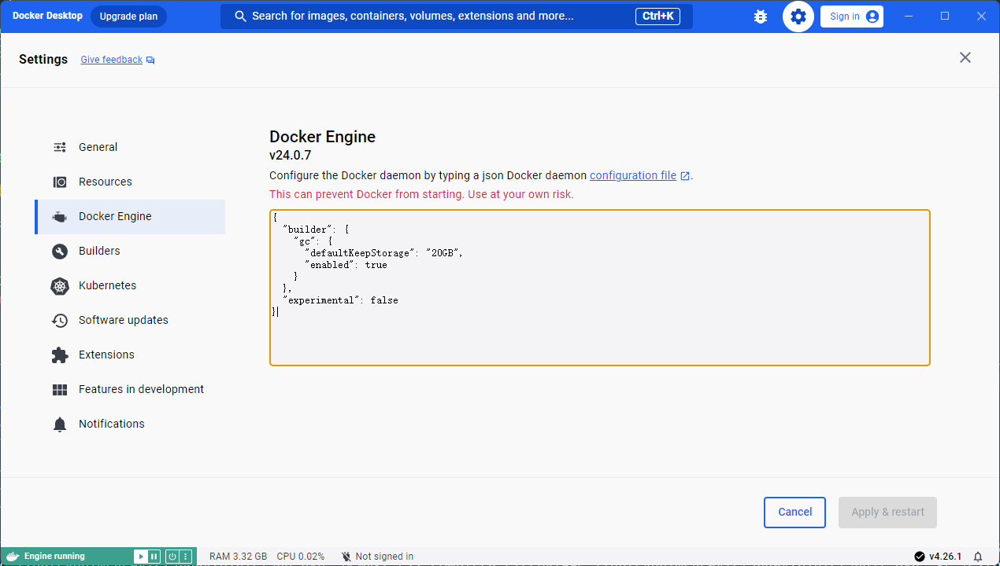

# Docker安装Ubuntu-22.04并配置开发环境

## 下载安装Docker Desktop Installer

具体请参考如下的网址了解如何安装Docker Desktop Installer

<https://docs.docker.com/desktop/install/windows-install/>

下载网址：
<https://desktop.docker.com/win/main/amd64/Docker%20Desktop%20Installer.exe>

可尝试用如下的代理下载，可能快些。
<https://proxy.201704.xyz/https://desktop.docker.com/win/main/amd64/Docker%20Desktop%20Installer.exe>

## Docker Desktop的配置

打开Docker Desktop设置 > Docker Engine。

默认情况下配置如图所示：



增加registry-mirrors键值，然后点击"Apply & restart"。

具体的信息如下所示：

```yaml
{
  "builder": {
    "gc": {
      "defaultKeepStorage": "20GB",
      "enabled": true
    }
  },
  "experimental": false,
  "registry-mirrors": [
    "https://registry.docker-cn.com",
    "https://docker.mirrors.ustc.edu.cn",
    "http://hub-mirror.c.163.com"
  ]
}
```


## 下载Ubuntu镜像并配置环境

在命令行界面进入tools目录下，然后执行如下的命令：

```shell
docker build -t ubuntu2204-dev .
```

在该镜像中会创建一个普通用户code，其密码为password，供开发时使用。

## 创建容器并运行Ubuntu容器

在命令行界面进入本项目的tools目录下，然后执行如下的命令：

```shell
docker run -id --name ubuntu-compile --hostname ubuntu-compile ubuntu2204-dev
```

## 进入Ubuntu容器查看

```shell
docker exec -it ubuntu-compile /bin/zsh
```

## 停止Ubuntu容器

```shell
docker stop ubuntu-compile
```

## 启动Ubuntu容器

```shell
docker start ubuntu-compile
```

## 重启Ubuntu容器

也就是先停止后启动容器

```shell
docker restart ubuntu-compile
```

## VSCode联动

通过安装Dev Containers插件后，可以连接到容器上进行软件开发。

## 删除镜像

```shell
docker rmi ubuntu2204-dev
```
